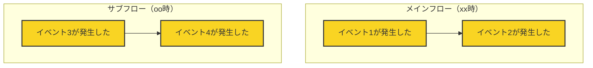

# イベントストーミングワークショップのルール

## イベントストーミングの概要

イベントストーミングは、ビジネスプロセスを明確にモデル化するためのワークショップ形式の手法です。
ドメインイベントをタイムラインに沿って配置し、複雑なビジネスプロセスを可視化します。

## モデリングの表記法

イベントストーミングでは、以下の色分けされた要素を使用します：

- ドメインイベント（Domain Event／橙色／🟧）
  ビジネスドメインにとって関心のある出来事を表します。過去形動詞を使い、専門用語を避け、シンプルな言葉で記述します。
- コマンド（Command／青色／🟦）
  ドメインイベントにつながるトリガまたは操作を記述します。ユーザーアクションや外部システム、時間ベースの活動などが該当します。
- ユーザーの役割（User Role／白色／⬜）
  ユーザーがどのような役割でコマンドを起動するかを示します。
- 外部システム（External System／茶色／🟫）
  ドメインの外側にある管理対象外のソフトウェアやシステムを指します。クラウドサービスやサードパーティアプリケーションなどが含まれます。
- 懸念事項（Issue／紫色／🟪）
  参加者が説明が必要だと感じる懸念事項を記述します。完全に理解できていない点や、権限の範囲、終わりの状態などが例です。
- 集約（Aggregate／黄色／🟨）
  コマンドが処理できるデータのまとまりを指します。1つまたは複数のエンティティの整合性を保つ境界を定義し、集約内の1つのエンティティがルートとなります。
- 方針（Policy／緑色／🟩）
  ドメインイベントの結果として実行されるロジックを記述します。1つのドメインイベントが複数の方針につながる場合もあります。
- 読み取りモデル（Read Model／黒色／⬛）
  アクションを実行するために必要なデータを記述します。集約とは別に、画面表示や意思決定に使うデータです。

それぞれの要素は、以下の関係を持ちます：

- **ユーザーの役割（User Role／白色／⬜）がコマンド（Command／青色／🟦）**を呼び出します（invokes）。
- **コマンド（Command／青色／🟦）は集約（Aggregate／黄色／🟨）や外部システム（External System／茶色／🟫）**に対して処理を実行します（invoked on）。
- **集約（Aggregate／黄色／🟨）や外部システム（External System／茶色／🟫）は、処理の結果としてドメインイベント（Domain Event／橙色／🟧）**を生成します（generates）。
- **ドメインイベント（Domain Event／橙色／🟧）は方針（Policy／緑色／🟩）**をトリガーします（triggers）。
- **方針（Policy／緑色／🟩）は再びコマンド（Command／青色／🟦）**を呼び出すことができます（invokes）。
- **読み取りモデル（Read Model／黒色／⬛）はドメインイベント（Domain Event／橙色／🟧）**から変換されてユーザーに情報を提供します（Translated into）。
- ユーザーは**読み取りモデル（Read Model／黒色／⬛）**を参照し、必要に応じてコマンドを実行します。
- **懸念事項（Issue／紫色／🟪）**は他の要素とは直接結ばれていませんが、全体の設計や議論の中で考慮されるべき事項として存在します。

## イベントストーミングのステップ

### ステップ1：ドメインイベントと外部システムの抽出

ドメインで発生するイベントを洗い出し、タイムライン上に配置します。
タイムラインとは左から右に流れる時間の流れを示すもので、ドメインイベントはこのタイムライン上に配置されます。
ドメインイベントと外部システムとの関わりも特定します（発生順に並べます）。

ドメインイベントは過去形の動詞で表現し、ビジネスドメインにとって重要な出来事を示します。
複数のシナリオが存在する場合は、シナリオごとに分けて考えます（シナリオごとに横のラインを作成します）。
本ステップで解消できないアイテムが発生した場合は、次以降のステップで検討するため保留事項（Future Placement Board）に記載します。

ドメインイベントと外部システムの抽出完了後、参加者間の共通言語形成のためにユビキタス言語辞書の作成を行います。
ユビキタス言語辞書は日本語、適切な英訳（直接翻訳するのではなく意味として適切となるもの）、変数名（関数名）、言語の意味、仕様コンテキスト（サブシステム名）、最終更新日を定義します。
ドメインエキスパートの観点で、ユビキタス言語辞書を総チェックし、問題があれば修正します。

最後に、チェックリストの確認を行い、チェックリストを満たさない場合は、ここまでの過程を再考してください。

結果は `specs/step1.md` に markdown 形式で保存します。
モデリング結果を以下のテンプレートで作成してください。

````md
# ステップ1：ドメインイベントと外部システムの抽出

## タイムライン



## タイムラインの説明

- イベント1（ドメインイベント🟧）
  イベント1の説明
- イベント2（ドメインイベント🟧）
  イベント2の説明
- システム1（外部システム🟫）
  システム1の説明

## 保留事項
|タイプ|内容|検討ステップ|
|-|-|-|
|コマンド🟦|ユーザーの動作|ステップ2|
|懸念事項🟪|xxフローとooフローとの整合性|ステップ2|
|懸念事項🟪|イベント3での算出根拠|ステップ3|

## ユビキタス言語辞書

|項番|日本語|英語|コード変数|意味|使用コンテキスト|最終更新|
|-|-|-|-|-|-|-|
|1|ユビキタス言語1|ubiquitous1|ubiquitous1|ユビキタス言語1の説明|コンテキスト|2025-04-21|
|2|注文受付|OrderReceived|OrderService.receive|顧客からの注文をシステムが受理|ECサイト|2025-04-21|

## チェックリスト

完了基準(21項目)の確認結果

### ドメインイベントの質と量

- [] すべてのドメインイベントが過去形の動詞で表現されている
- [] ドメインイベントがオレンジ色の付箋に1つずつ記載されている
- [] 十分な量のドメインイベントが出されている（質より量を重視）
- [] 重複や類似するイベントが許容されている（この段階での整理は不要）
- [] すべての主要なビジネスプロセスがイベントとして表現されている
- [] ドメインイベントがビジネス上の「重要な出来事」を表している

### 外部システムの識別

- [] システムに関連する外部システムやサービスが識別されている
- [] 外部システム起因のイベントが茶色で記録されている
- [] 外部システムとの連携点・インターフェースが明示されている

### ユビキタス言語品質基準

- [ ] 技術用語とビジネス用語の整合性
- [ ] コード変数名の命名規則準拠
- [ ] コンテキスト依存性の明示
- [ ] 過去形動詞との矛盾なし

### シナリオ整合性

- [ ] 各フロー間のイベント競合なし
- [ ] 共有リソースの状態の整合性

### 見直し

- [] ビジネスドメイン上で発生するすべての重要なイベントを挙げられたか？
- [] 見落としている重要なビジネスプロセスはないか？
- [] 現在のイベント群は、ドメインの全体像を十分に表しているか？

- [] イベントの表現は全て過去形になっているか？
- [] イベントの粒度は適切か？（細かすぎたり、大きすぎたりしていないか？）
- [] 類似するイベントが多数ある領域は、さらに詳細化が必要ではないか？

- [] すべての外部システムとの連携点を特定できたか？
- [] 外部システム起因のイベントは明確に区別されているか？
- [] 外部システムとの連携において、見落としている重要なイベントはないか？

- [] 疑問点や懸念事項は全てピンク付箋に記録されているか？
- [] 次のステップ（イベントの蒸留）に進む準備ができているか？
- [] 現状の時系列の流れに矛盾や不自然な点はないか？

- [] 変更履歴を記載したか？

## 補足

補足がない場合、「補足なし」と記載する。

## 変更履歴

|更新日時|変更点|
|-|-|
|2025-04-21T09:00:00+09:00|新規作成|

（更新日時の降順で記載する）

````

### ステップ2：イベントとシステム間のギャップを埋める

コマンド、アクター、ポリシーなどを追加して、イベント間のフローを完成させます。
結果は `specs/step2.md` に mermaid 形式で保存します。

### ステップ3：集約の抽出

フローから集約（関連するエンティティのグループ）を抽出します。
結果は `specs/step3.md` に mermaid 形式で保存します。

### ステップ4：境界づけられたコンテキストの定義

集約、ビジネスルール、共通言語に基づいてコンテキストの境界を決定します。
結果は `specs/step4.md` に mermaid 形式で保存します。

## 対話のルール

1. 各ステップは質問と回答の形で進めます
2. AIは各ステップの説明とガイダンスを提供します
3. あなたはビジネスドメインについての情報を提供します
4. 各ステップの結果は指定のMarkdownファイルに記録します
5. 次のステップに進む前に、現在のステップの結果を確認します

## ファイル管理

- 各ステップの結果は `specs/` ディレクトリに保存します
- 最終的なモデルは `specs/final-model.md` に保存します
