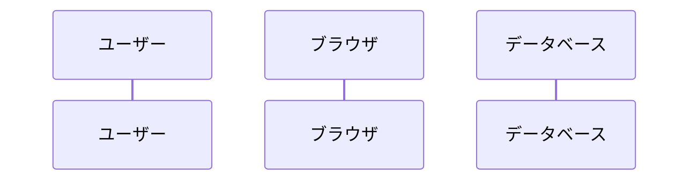
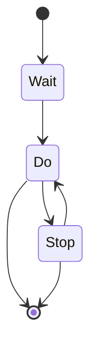
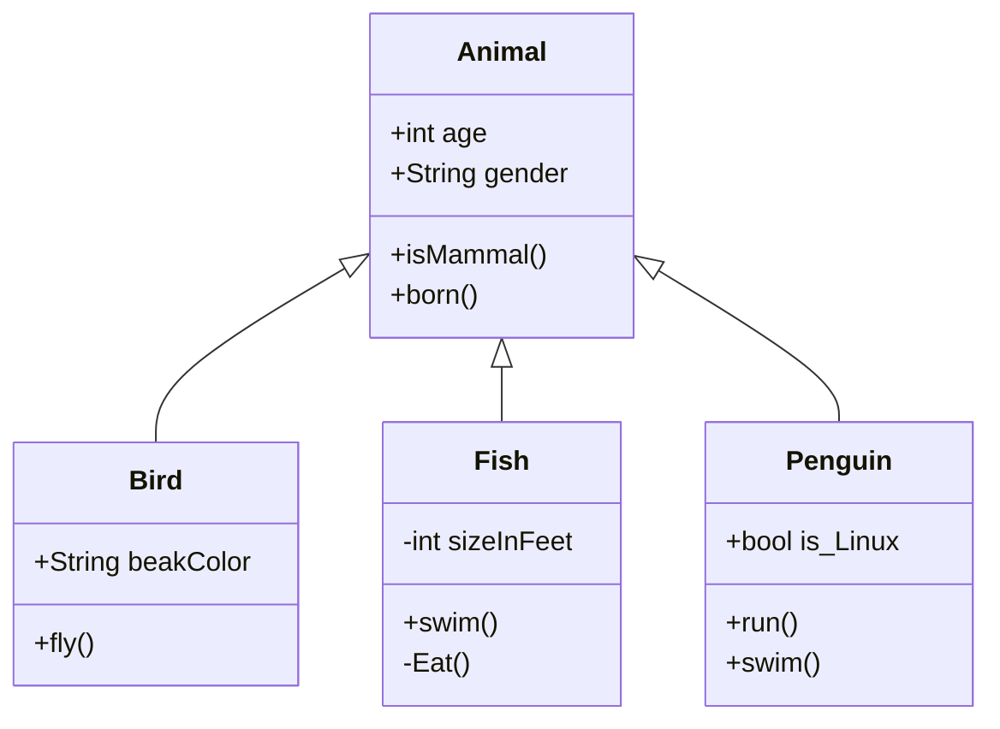

# 静的モデリングのルール

本ファイルに記載された内容を「静的モデリングルール」と定義します。
例えば、『静的モデリングを実施してください』とは、本ファイルに記載されたすべてのステップを実行することを指します。
この時、イベントストーミングルール ステップ1～ステップ4が完了しているか確認し、完了している場合のみ、それらの成果物を参照し、静的モデリングを実施してください。
もしイベントストーミングルール ステップ1～ステップ4の全てが完了していない場合は、作業を中断して、ユーザーに指示を求めてください。

まず、イベントストーミングルールステップ4の結果に記載している保留事項について検討します。
保留事項は実装に必要な情報のため、必ず解消してください。
もし解消できない場合は、ユーザーに指示を求めてください。

次に、シーケンス図を作成します。
シーケンス図はメッセージフローの具体化を目的としています。
イベントストーミングの結果からオブジェクト名を使用してください。
もし、相応しいオブジェクト名が見つからない場合は、新しく作成し、ユーザーに許可を求めてください。

次にステートマシン図を作成します。
ステートマシン図は、アプリケーションのライフサイクル管理を行います。

次に、クラス図を作成します。
クラス図は静的構造の形式化を行います。
境界づけられたコンテキスト、集約、コマンドなどに十分に注意を払いながら、イベントストーミングの結果を反映してください。

結果は `.clinerules/specs/step5-design.md` に markdown 形式で保存します。
モデリング結果を以下のテンプレートで作成してください。

````md
# 静的モデリング

## シーケンス図 <〇〇処理>



1. 手続き1
   手続き1についての補足説明
2. 手続き2
   手続き2についての補足説明

## ステートマシン図



1. 初期状態
   初期状態についての補足説明
2. Wait状態
   Wait状態についての補足説明

## クラス図



1. Animalクラス
   Animalクラスについての補足説明
2. isMammalメソッド
   isMammalメソッドについての補足説明

## チェックリスト


## 補足

補足がない場合、「補足なし」と記載する。

## 変更履歴

|更新日時|変更点|
|-|-|
|2025-04-21T09:00:00+09:00|新規作成|

（更新日時の降順で記載する）

````

mermaidで作図をする際、下記の作成ルールを必ず順守してください。

1. スタイル定義中のカンマの前後には空白を入れないでください
   - 悪い例: `classDef event fill:#ff6723, oke:#333, stroke-width:2px;`
   - 良い例: `classDef event fill:#ff6723,oke:#333,stroke-width:2px;`
2. クラス定義中のカンマの前後には空白を入れないでください
   - 悪い例: class class1, class2, class3 event;
   - 良い例: class class1,class2,class3 event;
3. 【厳禁】行末にコメントを追加しないでください。コメントは必ず独立した行に記述してください。
   - 悪い例: `NodeA --> NodeB %% これは行末コメントです`
   - 良い例:

     ````md
     ```mermaid
     graph TB
         %% これは独立した行のコメントです
         NodeA --> NodeB
     ```
     ````
