# ステップ2：イベントとシステム間のギャップを埋める

## タイムライン

```mermaid
graph LR
    subgraph MainFlow[ログ書き込み・アップロードフロー]
        direction LR
        User([一般ユーザー<br/>⬜]) -.-> CmdLogWrite(ログ書き込みボタンを押す<br/>🟦)
        CmdLogWrite -- invokes --> AggLog(ログファイル<br/>🟨)
        AggLog -- generates --> EvtLogWritten(ログがファイルに書き込まれた<br/>LogWrittenToFile 🟧)

        EvtLogWritten -- triggers --> PolUpload(方針: ログ書き込み後アップロード<br/>🟩)
        PolUpload -- invokes --> CmdUpload(ファイルをアップロードする<br/>🟦)
        CmdUpload -- uses --> RMAuth(認証情報<br/>⬛)
        CmdUpload -- uses --> RMLogFile(ログファイル<br/>⬛)
        CmdUpload -- invoked on --> ExtIoTHub(Azure IoT Hub<br/>🟫)

        subgraph UploadOutcome[アップロード結果]
            direction TB
            ExtIoTHub -- generates --> EvtUploaded(ファイルがアップロードされた<br/>FileUploaded 🟧)
            ExtIoTHub -- generates --> EvtUploadFailed(ファイルアップロードに失敗した<br/>FileUploadFailed 🟧)
        end

        EvtUploaded -- triggers --> PolShowSuccess(方針: アップロード成功時<br/>🟩)
        PolShowSuccess -- invokes --> CmdShowSuccess(成功ダイアログを表示する<br/>🟦)
        CmdShowSuccess -- generates --> EvtSuccessDlg(成功ダイアログが表示された<br/>SuccessDialogDisplayed 🟧)

        EvtUploadFailed -- triggers --> PolShowFailure(方針: アップロード失敗時<br/>🟩)
        PolShowFailure -- invokes --> CmdShowFailure(失敗ダイアログを表示する<br/>🟦)
        CmdShowFailure -- generates --> EvtFailureDlg(失敗ダイアログが表示された<br/>FailureDialogDisplayed 🟧)

        subgraph DialogInteraction[ダイアログ操作]
             direction LR
             EvtSuccessDlg --> UserDlgOk(ユーザー<br/>⬜)
             EvtFailureDlg --> UserDlgOk
             UserDlgOk -.-> CmdOk(OKボタンを押す<br/>🟦)
        end

    end

    subgraph AppClose[アプリケーション終了フロー]
         direction LR
         UserClose([一般ユーザー<br/>⬜]) -.-> CmdClose(×ボタンを押す<br/>🟦)
         CmdClose -- generates --> EvtClosed(アプリケーションが終了された<br/>ApplicationClosed 🟧)
    end

    %% スタイル定義
    classDef event fill:#ff6723,stroke:#333,stroke-width:2px;
    classDef command fill:#00a6ed,stroke:#333,stroke-width:2px;
    classDef user fill:#ffffff,stroke:#333,stroke-width:2px;
    classDef externalSystem fill:#a56953,stroke:#333,stroke-width:2px;
    classDef aggregate fill:#ffb02e,stroke:#333,stroke-width:2px;
    classDef policy fill:#00d26a,stroke:#333,stroke-width:2px;
    classDef readModel fill:#000000,color:#fff,stroke:#333,stroke-width:2px;

    class EvtLogWritten,EvtUploaded,EvtUploadFailed,EvtSuccessDlg,EvtFailureDlg,EvtClosed event;
    class CmdLogWrite,CmdUpload,CmdShowSuccess,CmdShowFailure,CmdOk,CmdClose command;
    class AggLog aggregate;
    class ExtIoTHub externalSystem;
    class PolUpload,PolShowSuccess,PolShowFailure policy;
    class User,UserDlgOk,UserClose user;
    class RMAuth,RMLogFile readModel;

    %% 外部システム (Blob Storageは直接的なイベント生成/コマンド受け付けがないため図からは省略)
    %% ExtBlob[Azure Blob Storage<br/>🟫]
    %% class ExtBlob externalSystem;
    %% CmdUpload --> ExtBlob %% 関係性としては存在する

    %% 読み取りモデル (現在時刻はログ書き込みコマンド内で使用されるが、主要フローではないため省略)
    %% RMTime(現在時刻<br/>⬛)
    %% class RMTime readModel;
    %% CmdLogWrite -- uses --> RMTime
```

## フローの説明

### アクター（ユーザーの役割 ⬜）
- **一般ユーザー (GeneralUser)**
  - アプリケーションを操作するユーザー。ログ書き込みボタン、×ボタン、ダイアログのOKボタンを押します。

### コマンド 🟦
- **ログ書き込みボタンを押す (PressLogWriteButton)**
  - ユーザーがGUIのボタンを押すアクション。`ログを書き込む`処理をトリガーします。（内部的に`現在時刻`⬛ を参照してファイル名とログ内容を決定）
- **ファイルをアップロードする (UploadFile)**
  - `ログファイル`🟨 を `Azure IoT Hub`🟫 経由でAzure Blob Storageへアップロードする処理を開始します。`認証情報`⬛ を使用します。UIをブロッキングします。
- **成功ダイアログを表示する (ShowSuccessDialog)**
  - アップロード成功時に「成功」と表示されたダイアログをユーザーに提示します。
- **失敗ダイアログを表示する (ShowFailureDialog)**
  - アップロード失敗時に「失敗」と表示されたダイアログをユーザーに提示します。
- **OKボタンを押す (PressOkButton)**
  - 成功または失敗ダイアログに表示された「OK」ボタンをユーザーが押すアクション。ダイアログを閉じます。
- **×ボタンを押す (PressCloseButton)**
  - ユーザーがアプリケーションウィンドウの×ボタンを押すアクション。`アプリケーションを終了する`処理をトリガーします。

### 集約と外部システム 🟨🟫
- **ログファイル (LogFile) 🟨**
  - アプリケーションが管理する主要なデータ。日付ごとのログファイル（例: `2025-04-26.log`）を表します。`ログ書き込みボタンを押す`コマンドによって状態（内容）が変更されます。
- **Azure IoT Hub (🟫)**
  - ファイルアップロードのためのSAS URI提供やデバイス認証を行う外部システム。`ファイルをアップロードする`コマンドが作用し、結果として`ファイルがアップロードされた`または`ファイルアップロードに失敗した`イベントを生成します。（Blob Storageへの実際のアップロードはこのHub経由で行われます）
- **Azure Blob Storage (🟫)**
  - ログファイルが最終的に格納される外部システム。（Mermaid図では直接的なやり取りがないため省略）

### ドメインイベント 🟧
- **ログがファイルに書き込まれた (LogWrittenToFile)**
  - `ログファイル`🟨 への書き込み（新規作成または追記）が完了したことを示します。
- **ファイルがアップロードされた (FileUploaded)**
  - `Azure IoT Hub`🟫 経由でのBlob Storageへのファイルアップロードが成功したことを示します。
- **ファイルアップロードに失敗した (FileUploadFailed)**
  - `Azure IoT Hub`🟫 との通信エラーやBlob Storageへのアップロードエラーが発生したことを示します。
- **成功ダイアログが表示された (SuccessDialogDisplayed)**
  - ユーザーにアップロード成功のダイアログが表示されたことを示します。
- **失敗ダイアログが表示された (FailureDialogDisplayed)**
  - ユーザーにアップロード失敗のダイアログが表示されたことを示します。
- **アプリケーションが終了された (ApplicationClosed)**
  - `×ボタンを押す`コマンドにより、アプリケーションが終了処理を完了したことを示します。

### 方針 🟩
- **方針: ログ書き込み後アップロード (Policy: UploadAfterLogWrite)**
  - `ログがファイルに書き込まれた`🟧 イベントが発生した場合、自動的に `ファイルをアップロードする`🟦 コマンドを実行します。
- **方針: アップロード成功時 (Policy: OnUploadSuccess)**
  - `ファイルがアップロードされた`🟧 イベントが発生した場合、自動的に `成功ダイアログを表示する`🟦 コマンドを実行します。
- **方針: アップロード失敗時 (Policy: OnUploadFailure)**
  - `ファイルアップロードに失敗した`🟧 イベントが発生した場合、自動的に `失敗ダイアログを表示する`🟦 コマンドを実行します。

### 読み取りモデル ⬛
- **認証情報 (AuthenticationInfo)**
  - `ファイルをアップロードする`🟦 コマンドが `Azure IoT Hub`🟫 に接続するために必要な情報（`appsettings.json` から読み込まれる）。
- **ログファイル (LogFile)**
  - `ファイルをアップロードする`🟦 コマンドがアップロード対象として参照するファイルの内容やパス情報。
- **現在時刻 (CurrentTime)**
  - `ログ書き込みボタンを押す`🟦 コマンドがログファイル名の決定やログエントリのタイムスタンプ生成のために内部的に参照する情報。（Mermaid図では省略）

## 保留事項 (Future Placement Board)
|タイプ|内容|検討ステップ|
|-|-|-|
|懸念事項🟪|ログのランダムメッセージ生成ロジック|ステップ3|
|懸念事項🟪|IoT Hubへの再接続試行ロジック（アップロード失敗時のハンドリングに含まれるか要確認）|ステップ3|
|懸念事項🟪|UIブロッキングの具体的な実装方法|ステップ3以降|
|懸念事項🟪|アップロードタイムアウトの扱い（`FileUploadFailed`イベントに含まれるか要確認）|ステップ3|
|集約🟨|ログファイル集約の具体的な属性（ファイルパス、最終書き込み時刻など）|ステップ3|
|集約🟨|アプリケーション設定集約（認証情報などを含むか）|ステップ3|

## ユビキタス言語辞書 (ステップ1からの差分・変更)

| 項番 | 日本語                     | 英語                       | コード変数/関数名              | 意味                                                                   | 使用コンテキスト     | 最終更新   |
| :--- | :------------------------- | :------------------------- | :----------------------------- | :--------------------------------------------------------------------- | :--------------- | :--------- |
| 21   | ログ書き込みボタンを押す   | Press Log Write Button     | `LogWriteButton_Click`         | ユーザーがログ書き込みボタンを押すUIイベントハンドラ                     | UI操作           | 2025-04-26 |
| 22   | ファイルをアップロードする | Upload File                | `UploadFileAsync`              | ログファイルをAzureにアップロードするコマンド/メソッド                   | Azure連携, コマンド | 2025-04-26 |
| 23   | 成功ダイアログを表示する   | Show Success Dialog        | `ShowSuccessDialog`            | 成功ダイアログを表示するコマンド/メソッド                              | UI表示, コマンド   | 2025-04-26 |
| 24   | 失敗ダイアログを表示する   | Show Failure Dialog        | `ShowFailureDialog`            | 失敗ダイアログを表示するコマンド/メソッド                              | UI表示, コマンド   | 2025-04-26 |
| 25   | OKボタンを押す             | Press OK Button            | `Dialog_OkButton_Click`        | ダイアログのOKボタンが押された際のUIイベントハンドラ                   | UI操作           | 2025-04-26 |
| 26   | ×ボタンを押す              | Press Close Button         | `MainWindow_Closing`           | ユーザーがウィンドウの閉じるボタンを押すUIイベントハンドラ               | UI操作           | 2025-04-26 |
| 27   | 一般ユーザー               | General User               | `user` (概念)                  | アプリケーションを操作するアクター                                     | アクター         | 2025-04-26 |
| 28   | ログ書き込み後アップロード | Upload After Log Write     | (方針名、コード直結しない)     | ログ書き込み完了後にアップロードを開始するビジネスルール                 | 方針             | 2025-04-26 |
| 29   | アップロード成功時の方針   | On Upload Success Policy   | (方針名、コード直結しない)     | アップロード成功時に成功ダイアログを表示するビジネスルール               | 方針             | 2025-04-26 |
| 30   | アップロード失敗時の方針   | On Upload Failure Policy   | (方針名、コード直結しない)     | アップロード失敗時に失敗ダイアログを表示するビジネスルール               | 方針             | 2025-04-26 |
| 31   | 現在時刻                   | Current Time               | `DateTimeOffset.Now` (JST)     | ログファイル名やタイムスタンプ取得に必要な現在の時刻情報 (JST)         | 読み取りモデル   | 2025-04-26 |

**変更:**
*   ステップ1の `6: ファイルアップロード` を `22: ファイルをアップロードする` (コマンド) に変更。
*   ステップ1の `7: ログ書き込み` をコマンド `21: ログ書き込みボタンを押す` の内部処理として整理。
*   ステップ1の `8: 成功ダイアログ` を `23: 成功ダイアログを表示する` (コマンド) に変更。
*   ステップ1の `9: 失敗ダイアログ` を `24: 失敗ダイアログを表示する` (コマンド) に変更。
*   ステップ1の `10: アプリケーション終了` を `26: ×ボタンを押す` (コマンド) に変更。
*   ステップ1の `13: 認証情報` を読み取りモデルとして再定義。
*   ステップ1の `1: ログファイル` を集約🟨および読み取りモデル⬛として再定義。

**注意:** ユビキタス言語辞書の変更について、`.clinerules/010-modeling.md` の指示に基づき、本来はステップ1の成果物 (`.clinerules/specs/step1.md`) を変更すべきですが、ルール上禁止されているため、ステップ2の差分として記載しています。

## チェックリスト

完了基準の確認結果

### コマンドの質と量
- [x] すべてのドメインイベントに対して、それを引き起こすコマンドまたはトリガーとなるイベント/方針が特定されている
- [x] コマンドが命令形の動詞で明確に表現されている
- [x] コマンドが青色の付箋に一つずつ記載されている
- [x] 複合的なコマンドが適切に分解されている (例: ログ書き込みボタン押下 -> 内部で時刻取得、ファイル書き込み)

### アクターの識別
- [x] すべてのコマンドに対して、それを実行するアクターまたはシステム方針が特定されている
- [x] アクターが白色の付箋に記載されている
- [x] アクターの権限や役割が明確に定義されている (今回は一般ユーザーのみ)
- [x] システムによる自動アクションも方針として明示されている

### 方針の定義
- [x] イベント間の自動的な連鎖が方針として特定されている
- [x] 方針が緑色の付箋に条件付きルールとして記載されている
- [x] 方針からトリガーされる新たなコマンドが明確になっている
- [x] 複雑なビジネスルールが適切に方針として表現されている (今回は単純な連鎖)

### 読み取りモデルの特定
- [x] ユーザーやコマンドの意思決定/実行に必要な情報が読み取りモデルとして特定されている
- [x] 読み取りモデルが黒色の付箋に記載されている
- [x] 情報の参照タイミングと目的が明確になっている
- [x] UIとの関連性が考慮されている (直接的ではないが、コマンド実行の前提となる情報)

### リレーションの明確さ
- [x] 要素間の関係が矢印などで明確に表現されている (Mermaid図)
- [x] フローの流れが視覚的に理解できる
- [x] 複雑な条件分岐が適切に表現されている (アップロード成功/失敗)
- [x] フィードバックループが識別されている (該当なし)

### フローの一貫性
- [x] 開始から終了までの一連のフローが完成している (ログ書き込みフロー、終了フロー)
- [x] 時系列が論理的に矛盾なく表現されている
- [x] 例外ケースやエラー処理も考慮されている (アップロード失敗)
- [x] 並行して進むプロセスが適切に表現されている (該当なし、UIブロッキングのため)

### 懸念事項の管理
- [x] 議論の過程で浮かび上がった疑問点や課題が紫色の付箋に記録されている (保留事項リスト)
- [x] 懸念事項に対するフォローアップの方法が決まっている (ステップ3以降で検討)
- [x] 解決できない懸念事項が次のステップへの課題として明確になっている

## 補足

- Mermaid図では、主要なフローと要素間の関係性を視覚化することに重点を置いています。Azure Blob Storageや読み取りモデルの「現在時刻」など、フローの理解に必須でない要素は省略しています。
- UIブロッキングは `ファイルをアップロードする` コマンドの性質として記述していますが、具体的な実装はステップ3以降で検討します。
- ユビキタス言語辞書の項番はステップ1から連番にしています。

## 変更履歴

|更新日時|変更点|
|-|-|
|2025-04-26T22:05:30+09:00|ステップ2のモデリング結果を新規作成|
