# ステップ3：集約の抽出

## タイムライン

```mermaid
graph LR
    subgraph MainFlow[ログ書き込み・アップロードフロー]
        direction LR
        User([一般ユーザー<br/>⬜]) -.-> CmdLogWrite(ログ書き込みボタンを押す<br/>🟦)
        CmdLogWrite -- invokes --> AggLog(ログファイル<br/>🟨)
        AggLog -- generates --> EvtLogWritten(ログがファイルに書き込まれた<br/>LogWrittenToFile 🟧)

        EvtLogWritten -- triggers --> PolUpload(方針: ログ書き込み後アップロード<br/>🟩)
        PolUpload -- invokes --> CmdUpload(ファイルをアップロードする<br/>🟦)
        CmdUpload -- uses --> RMAuth(認証情報<br/>⬛)
        CmdUpload -- uses --> RMLogFile(ログファイル<br/>⬛)
        CmdUpload -- invoked on --> ExtIoTHub(Azure IoT Hub<br/>🟫)

        subgraph UploadOutcome[アップロード結果]
            direction TB
            ExtIoTHub -- generates --> EvtUploaded(ファイルがアップロードされた<br/>FileUploaded 🟧)
            ExtIoTHub -- generates --> EvtUploadFailed(ファイルアップロードに失敗した<br/>FileUploadFailed 🟧)
        end

        %% --- ダイアログ表示フロー (UIシステム経由) ---
        EvtUploaded -- triggers --> PolShowSuccess(方針: アップロード成功時<br/>🟩)
        PolShowSuccess -- invokes --> CmdShowSuccess(成功ダイアログを表示する<br/>🟦)
        CmdShowSuccess -- invoked on --> UISystem(UIシステム<br/>🟫)
        UISystem -- generates --> EvtSuccessDlg(成功ダイアログが表示された<br/>SuccessDialogDisplayed 🟧)

        EvtUploadFailed -- triggers --> PolShowFailure(方針: アップロード失敗時<br/>🟩)
        PolShowFailure -- invokes --> CmdShowFailure(失敗ダイアログを表示する<br/>🟦)
        CmdShowFailure -- invoked on --> UISystem(UIシステム<br/>🟫)
        UISystem -- generates --> EvtFailureDlg(失敗ダイアログが表示された<br/>FailureDialogDisplayed 🟧)
        %% --- ここまで ---

        subgraph DialogInteraction[ダイアログ操作]
             direction LR
             EvtSuccessDlg --> UserDlgOk(ユーザー<br/>⬜)
             EvtFailureDlg --> UserDlgOk
             UserDlgOk -.-> CmdOk(OKボタンを押す<br/>🟦)
             CmdOk -- invoked on --> UISystem
             %% OKボタン押下によるイベントは今回は省略 (ダイアログが閉じるだけ)
        end

    end

    subgraph AppClose[アプリケーション終了フロー]
         direction LR
         UserClose([一般ユーザー<br/>⬜]) -.-> CmdClose(×ボタンを押す<br/>🟦)
         CmdClose -- invoked on --> UISystem(UIシステム<br/>🟫)
         UISystem -- generates --> EvtClosed(アプリケーションが終了された<br/>ApplicationClosed 🟧)
    end

    %% スタイル定義
    classDef event fill:#ff6723,stroke:#333,stroke-width:2px;
    classDef command fill:#00a6ed,stroke:#333,stroke-width:2px;
    classDef user fill:#ffffff,stroke:#333,stroke-width:2px;
    classDef externalSystem fill:#a56953,stroke:#333,stroke-width:2px;
    classDef aggregate fill:#ffb02e,stroke:#333,stroke-width:2px;
    classDef policy fill:#00d26a,stroke:#333,stroke-width:2px;
    classDef readModel fill:#000000,color:#fff,stroke:#333,stroke-width:2px;

    class EvtLogWritten,EvtUploaded,EvtUploadFailed,EvtSuccessDlg,EvtFailureDlg,EvtClosed event;
    class CmdLogWrite,CmdUpload,CmdShowSuccess,CmdShowFailure,CmdOk,CmdClose command;
    class AggLog aggregate;
    class ExtIoTHub,UISystem externalSystem;
    class PolUpload,PolShowSuccess,PolShowFailure policy;
    class User,UserDlgOk,UserClose user;
    class RMAuth,RMLogFile readModel;

    %% 外部システム (Blob Storageは直接的なイベント生成/コマンド受け付けがないため図からは省略)
    %% ExtBlob[Azure Blob Storage<br/>🟫]
    %% class ExtBlob externalSystem;
    %% CmdUpload --> ExtBlob %% 関係性としては存在する

    %% 読み取りモデル (現在時刻はログ書き込みコマンド内で使用されるが、主要フローではないため省略)
    %% RMTime(現在時刻<br/>⬛)
    %% class RMTime readModel;
    %% CmdLogWrite -- uses --> RMTime
```

（タイムラインはステップ2から変更ありません）

## 集約の説明

### LogFile (ログファイル) 🟨
- **説明**：特定の日付（JST基準）に対応するログファイルを表す集約。ログエントリの生成、ファイルへの追記、およびファイル名の管理を行う責務を持つ。`ログ書き込みボタンを押す`コマンドを受け付け、`ログがファイルに書き込まれた`イベントを生成する。
- **集約ルート**：LogFileエンティティ自身。ファイルパス（日付から決定される）によって一意に識別される。
- **含まれるエンティティ/値オブジェクト**：
    - FilePath (ファイルパス, VO): `yyyy-MM-dd.log` 形式のパス。
    - LogEntry (ログエントリ, VO): ログの単一レコード。
        - Timestamp (タイムスタンプ, VO): ISO 8601形式 (JST)。
        - EventType (イベントタイプ, Enum): START, STOP, WARN, ERROR のいずれか。
        - Comment (コメント, VO): ランダムに選択されるメッセージ。
- **不変条件**：
    - ファイル名は常に `yyyy-MM-dd.log` (JST) 形式である。
    - 各ログエントリは、有効なタイムスタンプ、イベントタイプ、コメントを含まなければならない。
    - ログエントリはJSON Lines形式でファイルに追記される。
    - ボタン押下時に日付が変わっていれば、新しい日付でファイルが作成される。

### (検討結果) ApplicationSettings (アプリケーション設定)
- ステップ2の保留事項にあった「アプリケーション設定集約」について検討した結果、今回のアプリケーションの範囲では、認証情報 (`appsettings.json`) は固定的な設定値であり、実行時に変更されるデータではないため、独立した集約として管理するよりも、設定読み込みサービスや読み取りモデル (`RMAuth`) を介してアクセスする方が適切と判断しました。そのため、正式な集約としては定義しません。

## 保留事項 (Future Placement Board)
|タイプ|内容|検討ステップ|
|-|-|-|
|懸念事項🟪|ログのランダムメッセージ生成ロジックの具体的な実装|ステップ4以降 (実装詳細)|
|懸念事項🟪|IoT Hubへの再接続試行ロジック（アップロード失敗時のハンドリングに含める）|ステップ4以降 (実装詳細)|
|懸念事項🟪|UIブロッキングの具体的な実装方法|ステップ4以降 (実装詳細)|
|懸念事項🟪|アップロードタイムアウトの扱い（`FileUploadFailed`イベントで表現）|ステップ4以降 (実装詳細)|
|集約🟨|LogFile集約とファイルシステム操作の整合性担保|ステップ4以降 (実装詳細)|

## ユビキタス言語辞書 (ステップ2からの差分・変更)

| 項番 | 日本語         | 英語           | コード変数/クラス名 | 意味                                                                 | 使用コンテキスト | 最終更新   |
| :--- | :------------- | :------------- | :------------------ | :------------------------------------------------------------------- | :----------- | :--------- |
| 33   | ログファイル集約 | LogFile Aggregate | `LogFile` (クラス)  | 特定日付のログファイルとその内容、不変条件を管理する集約             | ドメインモデル | 2025-04-27 |
| 34   | ログエントリ   | Log Entry      | `LogEntry` (クラス/VO) | タイムスタンプ、イベントタイプ、コメントを含む単一ログ記録             | ドメインモデル | 2025-04-27 |
| 35   | ファイルパス   | File Path      | `filePath` (変数/VO)| ログファイルの完全パス                                               | ドメインモデル | 2025-04-27 |
| 36   | 不変条件       | Invariant      | (概念/メソッド)     | 集約内で常に維持されるべきビジネスルール                             | ドメインモデル | 2025-04-27 |

**変更:**
* ステップ1, 2の `1: ログファイル` (概念/読み取りモデル) を `33: ログファイル集約` (集約) として再定義。
* ステップ1, 2の `2: ログエントリ` (概念) を `34: ログエントリ` (値オブジェクト) として再定義。

**注意:** ユビキタス言語辞書の変更について、`.clinerules/010-modeling.md` の指示に基づき、本来は以前のステップの成果物を変更すべきですが、ルール上禁止されているため、ステップ3の差分として記載しています。

## チェックリスト

完了基準の確認結果

### 集約の識別と定義
- [x] すべてのコマンドに対応する集約が特定されている (`CmdLogWrite` -> `LogFile`)
- [x] 集約が黄色の付箋に明確に名詞で表現されている (`LogFile`)
- [x] 集約の名前が適切で、その役割を反映している
- [x] 集約の境界が明確に定義されている (日付ごとのログファイル)

### 集約の粒度とまとまり
- [x] 集約の粒度が適切である（大きすぎず、小さすぎない）
- [x] 強い関連性を持つエンティティが同じ集約内にまとめられている (LogFileとLogEntry)
- [x] 集約が単一の責務を持ち、凝集度が高い (ログファイルの管理)
- [x] トランザクションの境界として機能するのに適した大きさになっている (ログ書き込み操作単位)

### 集約ルートの特定
- [x] 各集約のルートエンティティが明確に特定されている (`LogFile`自身)
- [x] 集約ルートが集約内の他のエンティティへのアクセスを制御する設計になっている (LogFile経由でLogEntryを操作)
- [x] 外部からのアクセスが集約ルートを通してのみ行われるようになっている (`CmdLogWrite`が`LogFile`を操作)

### 集約間の関係
- [x] 集約間の参照関係が適切に表現されている (今回はLogFile集約のみ)
- [x] 集約間の依存関係が最小限に抑えられている (今回はLogFile集約のみ)
- [x] 循環参照が避けられている (該当なし)
- [x] 必要に応じて集約間の整合性を保つ方針が考慮されている (該当なし)

### 不変条件の定義
- [x] 各集約の不変条件（ビジネスルール）が明確に記述されている
- [x] 不変条件が集約の境界と整合している
- [x] 不変条件が集約の一貫性を保証する上で適切である

### ユースケースの網羅性
- [x] すべての主要なユースケースが集約によってカバーされている (ログ書き込み)
- [x] 複数のユースケースにまたがる集約の責務が明確になっている (該当なし)
- [x] エッジケースやエラーケースも考慮されている (日付変更時のファイル作成)

## 補足

- 認証情報などのアプリケーション設定は、固定値として扱い、独立した集約とはしませんでした。設定読み込みサービス等で対応する想定です。
- 保留事項の多くは、具体的な実装レベルでの検討項目となります。

## 変更履歴

|更新日時|変更点|
|-|-|
|2025-04-27T20:25:00+09:00|ステップ3のモデリング結果を新規作成|
