# ステップ4：境界づけられたコンテキストの定義

## タイムライン

```mermaid
graph LR
    %% --- アクター ---
    User([一般ユーザー<br/>⬜])
    UserDlgOk([一般ユーザー<br/>⬜])
    UserClose([一般ユーザー<br/>⬜])

    %% --- 外部システム ---
    subgraph ExternalSystems[外部システム]
        direction TB
        ExtIoTHub(Azure IoT Hub<br/>🟫)
        UISystem(UIシステム<br/>🟫)
        %% ExtBlob(Azure Blob Storage<br/>🟫) %% Blob Storageは直接的な相互作用が少ないため省略
    end

    %% --- 境界づけられたコンテキスト: ログ管理 ---
    subgraph LogManagementContext[ログ管理コンテキスト]
        direction LR

        %% --- ログ書き込みフロー ---
        CmdLogWrite(ログ書き込みボタンを押す<br/>🟦) -- invokes --> AggLog(ログファイル<br/>🟨)
        AggLog -- generates --> EvtLogWritten(ログがファイルに書き込まれた<br/>LogWrittenToFile 🟧)

        %% --- アップロード準備と方針 ---
        EvtLogWritten -- triggers --> PolUpload(方針: ログ書き込み後アップロード<br/>🟩)
        PolUpload -- invokes --> CmdUpload(ファイルをアップロードする<br/>🟦)
        CmdUpload -- uses --> RMAuth(認証情報<br/>⬛)
        CmdUpload -- uses --> RMLogFile(ログファイル<br/>⬛)

        %% --- ダイアログ表示準備と方針 ---
        PolShowSuccess(方針: アップロード成功時<br/>🟩) -- invokes --> CmdShowSuccess(成功ダイアログを表示する<br/>🟦)
        PolShowFailure(方針: アップロード失敗時<br/>🟩) -- invokes --> CmdShowFailure(失敗ダイアログを表示する<br/>🟦)

        %% --- ダイアログ操作とアプリ終了準備 ---
        CmdOk(OKボタンを押す<br/>🟦)
        CmdClose(×ボタンを押す<br/>🟦)

    end

    %% --- コンテキスト内外の連携 ---

    %% ユーザーからUIシステムへの入力
    %% ボタン押下はUI経由だが、直接コマンド起動として表現
    User -.-> CmdLogWrite
    %% ダイアログのOKボタン
    UserDlgOk -.-> CmdOk
    %% 閉じるボタン
    UserClose -.-> CmdClose

    %% コマンドから外部システムへの指示 (境界を越える)
    CmdUpload -- invoked on --> ExtIoTHub
    CmdShowSuccess -- invoked on --> UISystem
    CmdShowFailure -- invoked on --> UISystem
    CmdOk -- invoked on --> UISystem
    CmdClose -- invoked on --> UISystem

    %% 外部システムからのイベント生成 (境界の外から発生)
    subgraph UploadOutcome[アップロード結果]
        direction TB
        ExtIoTHub -- generates --> EvtUploaded(ファイルがアップロードされた<br/>FileUploaded 🟧)
        ExtIoTHub -- generates --> EvtUploadFailed(ファイルアップロードに失敗した<br/>FileUploadFailed 🟧)
    end

    subgraph DialogAndCloseOutcome[ダイアログ表示・終了結果]
        direction TB
        UISystem -- generates --> EvtSuccessDlg(成功ダイアログが表示された<br/>SuccessDialogDisplayed 🟧)
        UISystem -- generates --> EvtFailureDlg(失敗ダイアログが表示された<br/>FailureDialogDisplayed 🟧)
        UISystem -- generates --> EvtClosed(アプリケーションが終了された<br/>ApplicationClosed 🟧)
    end

    %% 外部イベントからコンテキスト内の方針へのトリガー (境界を越える)
    EvtUploaded -- triggers --> PolShowSuccess
    EvtUploadFailed -- triggers --> PolShowFailure

    %% ダイアログ表示イベントからユーザーへの通知 (境界の外)
    EvtSuccessDlg --> UserDlgOk
    EvtFailureDlg --> UserDlgOk

    %% スタイル定義
    classDef event fill:#ff6723,stroke:#333,stroke-width:2px;
    classDef command fill:#00a6ed,stroke:#333,stroke-width:2px;
    classDef user fill:#ffffff,stroke:#333,stroke-width:2px;
    classDef externalSystem fill:#a56953,stroke:#333,stroke-width:2px;
    classDef aggregate fill:#ffb02e,stroke:#333,stroke-width:2px;
    classDef policy fill:#00d26a,stroke:#333,stroke-width:2px;
    classDef readModel fill:#000000,color:#fff,stroke:#333,stroke-width:2px;

    class EvtLogWritten,EvtUploaded,EvtUploadFailed,EvtSuccessDlg,EvtFailureDlg,EvtClosed event;
    class CmdLogWrite,CmdUpload,CmdShowSuccess,CmdShowFailure,CmdOk,CmdClose command;
    class AggLog aggregate;
    class ExtIoTHub,UISystem externalSystem;
    class PolUpload,PolShowSuccess,PolShowFailure policy;
    class User,UserDlgOk,UserClose user;
    class RMAuth,RMLogFile readModel;
```

## 境界づけられたコンテキストの説明

### LogManagementContext (ログ管理コンテキスト)
- **説明**: アプリケーションのコアロジックを担当する境界づけられたコンテキスト。ログファイルの生成、書き込み、日付管理、およびアップロード処理の準備（コマンド発行）に関する責務を持つ。
- **含まれる集約**: `LogFile` (ログファイル) 🟨
- **責務**:
    - 日付に基づいたログファイルの管理（作成、追記）。
    - ログエントリの生成とフォーマット（JSON Lines）。
    - ログ書き込み完了後のファイルアップロード処理のトリガー。
    - アップロード結果（成功/失敗）に応じたダイアログ表示処理のトリガー。
- **他コンテキストとの関係**:
    - このアプリケーションは単一のコンテキストで構成されるため、他の内部コンテキストとの関係はない。
    - **Azure IoT Hub (外部システム 🟫)**: ファイルアップロード処理（SAS URI取得、アップロード通知）を委譲する（公開ホスト/顧客パターンに近いが、より単純なコマンド発行）。アップロード結果イベントを受け取る。
    - **UI System (外部システム 🟫)**: ユーザーからの入力コマンド（ボタン押下）を受け付け、ダイアログ表示やアプリケーション終了のコマンドを発行する。表示完了や終了完了のイベントを受け取る。

## 保留事項 (Future Placement Board)
|タイプ|内容|今後の対応|
|-|-|-|
|懸念事項🟪|ログのランダムメッセージ生成ロジックの具体的な実装|実装フェーズ|
|懸念事項🟪|IoT Hubへの再接続試行ロジック（アップロード失敗時のハンドリングに含める）|実装フェーズ|
|懸念事項🟪|UIブロッキングの具体的な実装方法|実装フェーズ|
|懸念事項🟪|アップロードタイムアウトの扱い（`FileUploadFailed`イベントで表現）|実装フェーズ|
|集約🟨|LogFile集約とファイルシステム操作の整合性担保|実装フェーズ|
|境界づけられたコンテキスト|LogManagementContextと外部システム（IoT Hub, UI）間の具体的な連携方法（API設計、エラーハンドリング詳細）|実装フェーズ|
|境界づけられたコンテキスト|設定情報（認証情報）の安全な管理方法|実装フェーズ|

## ユビキタス言語辞書（ステップ3からの差分・変更）

| 項番 | 日本語                     | 英語                       | コード変数/クラス名        | 意味                                                                 | 使用コンテキスト     | 最終更新   |
| :--- | :------------------------- | :------------------------- | :------------------------- | :------------------------------------------------------------------- | :--------------- | :--------- |
| 37   | 境界づけられたコンテキスト | Bounded Context            | (概念)                     | 特定のドメインモデルが一貫性を持って適用される範囲                   | アーキテクチャ   | 2025-04-29 |
| 38   | ログ管理コンテキスト       | Log Management Context     | `LogManagement` (Namespace)| ログファイルの管理と関連操作を担当する境界づけられたコンテキスト       | アーキテクチャ   | 2025-04-29 |
| 39   | コンテキストマップ         | Context Map                | (概念図)                   | 境界づけられたコンテキスト間の関係を表現した図                       | アーキテクチャ   | 2025-04-29 |

**注意:** ユビキタス言語辞書の変更について、`.clinerules/010-modeling.md` の指示に基づき、本来は以前のステップの成果物を変更すべきですが、ルール上禁止されているため、ステップ4の差分として記載しています。

## チェックリスト

完了基準の確認結果

### 境界づけられたコンテキストの識別
- [x] 関連する集約が適切にグループ化されている (`LogFile`集約のみ)
- [x] 各コンテキストが明確な責務を持っている (`LogManagementContext`)
- [x] コンテキスト間の境界が明確に定義されている (内部ロジック vs 外部システム)
- [x] 各コンテキスト内のユビキタス言語が一貫している (単一コンテキストのため自明)

### コンテキストマップの作成
- [x] すべてのコンテキスト間の関係が定義されている (単一コンテキストと外部システムの関係)
- [x] 上流/下流関係が明確に示されている (該当なし、外部システムとの関係のみ)
- [x] 適切な統合パターン（共有カーネル、公開ホスト等）が特定されている (外部システムとの単純なコマンド/イベント連携)
- [x] コンテキスト間のデータ交換パターンが検討されている (コマンドパラメータ、イベントデータ)

### システム構造への影響
- [x] 各コンテキストがマイクロサービスの候補として評価されている (今回は単一コンテキストのためモノリス)
- [x] コンテキスト間の連携方法（API、イベント等）が検討されている (外部システムとの連携)
- [x] データの一貫性と整合性の戦略が検討されている (`LogFile`集約内で担保)
- [x] システム全体のスケーラビリティが考慮されている (今回の要件では限定的)

### ビジネス要件の充足
- [x] 定義されたコンテキストがビジネス要件を満たしている
- [x] 組織構造との整合性が取れている (該当なし)
- [x] 将来の変化に適応できる柔軟な構造になっている (責務分離はされている)
- [x] ビジネスの自律性や成長戦略と整合している (該当なし)

## 補足

- このアプリケーションは比較的小規模であり、単一の「ログ管理コンテキスト」で十分カバーできると判断しました。
- 外部システムとの連携は、コンテキストからコマンドを発行し、外部システムからのイベントを受け取る形としました。
- 保留事項の多くは、具体的な実装フェーズで詳細化される項目です。

## 変更履歴

|更新日時|変更点|
|-|-|
|2025-04-29T21:01:00+09:00|ステップ4のモデリング結果を新規作成|
