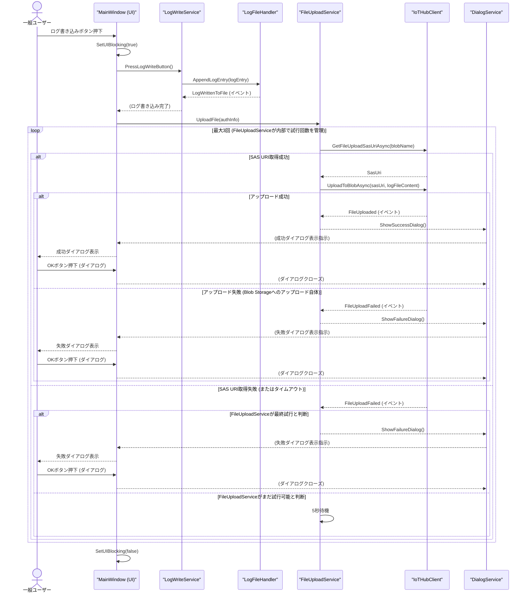
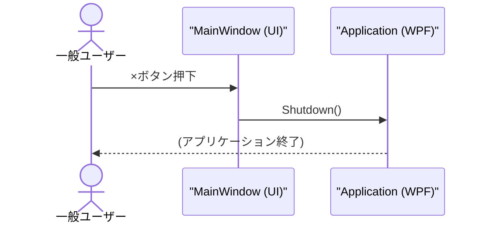
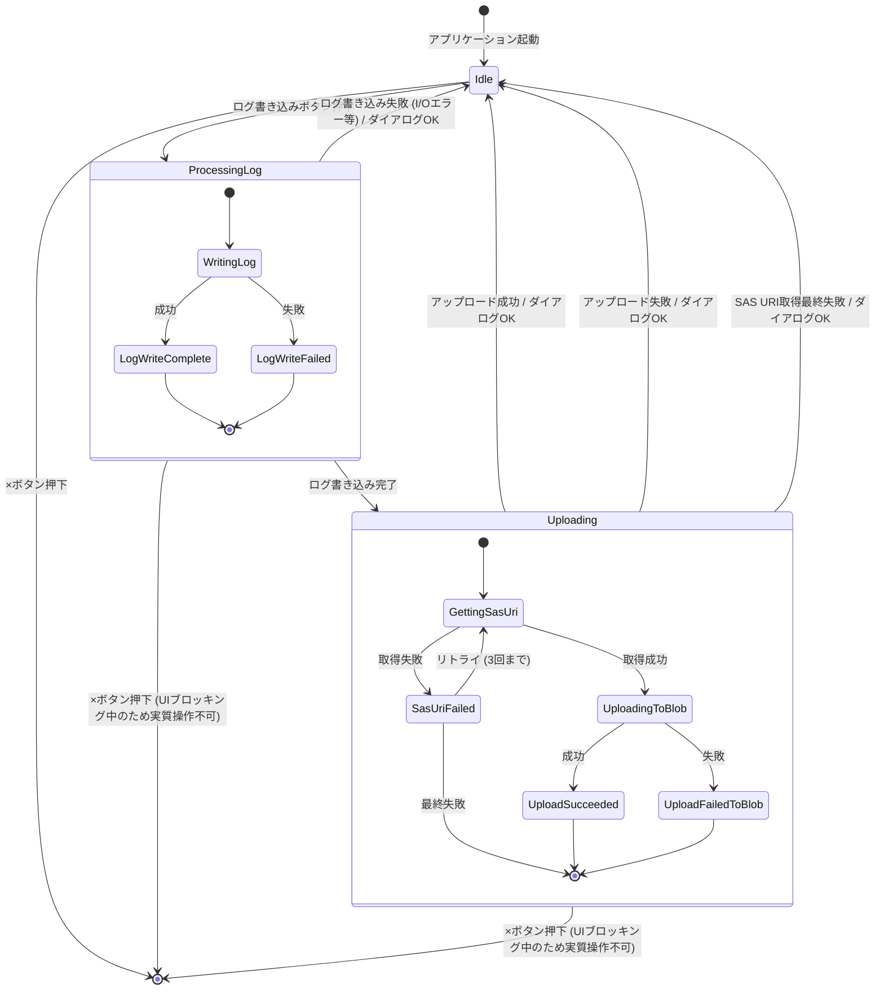
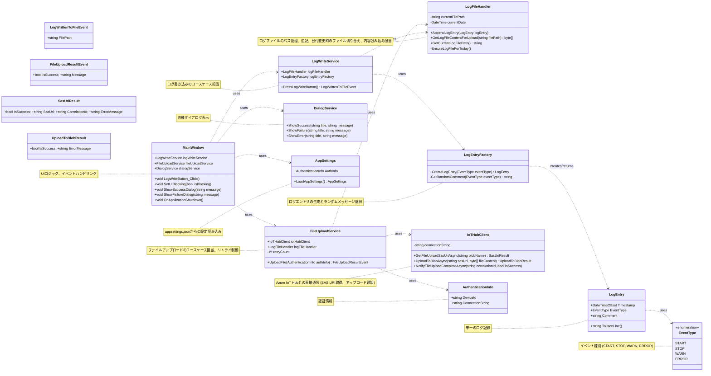

# 静的モデリング

## シーケンス図

### シーケンス図 <ログ書き込みとアップロード処理>

**説明:**

1.  一般ユーザーがログ書き込みボタンを押すと、UIがブロッキングされます。
2.  `LogWriteService` が `LogFileHandler` を使ってログエントリをファイルに追記します。
3.  ログ書き込み完了後、`FileUploadService` がアップロード処理を開始します。
4.  `FileUploadService` は `IoTHubClient` を介して最大3回SAS URIの取得を試みます。
    *   SAS URI取得に成功すると、Blob Storageへのアップロードを試行し、結果に応じて成功または失敗ダイアログを表示します。この時点でリトライは終了します。
    *   SAS URI取得に失敗した場合、最終試行でなければ5秒待機してリトライします。最終試行でも失敗した場合は失敗ダイアログを表示します。
5.  全ての処理が完了後、UIのブロッキングが解除されます。

### シーケンス図 <アプリケーション終了処理>

**説明:**

1.  一般ユーザーが×ボタンを押すと、`MainWindow` がWPFの `Application` オブジェクトに終了を指示します。
2.  アプリケーションが終了します。

## ステートマシン図

**説明:**

*   アプリケーションは主に `Idle` (待機中)、`ProcessingLog` (ログ処理中)、`Uploading` (アップロード中) の状態を取ります。
*   ユーザー操作や処理結果に応じて状態が遷移します。
*   `ProcessingLog` および `Uploading` 状態は、UIブロッキングによりユーザーが×ボタンを操作できない想定です。

## クラス図

**説明:**

*   主要なクラスとその責務、関連を示しています。
*   `LogFileHandler` はログファイルの操作を担当し、メモリ上に全ログエントリを保持しません。
*   イベントクラスは、処理結果やドメインイベントを運ぶデータ構造として概念的に示しています。

## チェックリスト

（静的モデリングルールにチェックリストのテンプレートがないため、ここでは省略します。）

## 補足

イベントストーミングステップ4の保留事項について、以下の通り仕様を決定しました。

1.  **ログのランダムメッセージ生成ロジック:**
    *   START: `運転を開始しました。`, `加工シーケンスを開始します。`
    *   STOP: `運転を停止しました。`, `現在の加工サイクルを完了し、停止しました。`
    *   WARN: `主軸モーターの温度が上昇しています。確認してください。`, `切削油の残量が少なくなっています。補充を検討してください。`
    *   ERROR: `サーボモーターエラーが発生しました。システムを停止します。 (コード: E012)`, `工具が破損しました。交換が必要です。機械を停止しました。`
2.  **IoT Hubへの再接続試行ロジック:** 1回のアップロード処理におけるIoT Hubへの再接続試行は最大3回、各試行の間隔は5秒とします。
3.  **UIブロッキングの具体的な実装方法:** アップロード処理中およびログ書き込み処理中は、メインウィンドウ全体を操作不可にし、マウスカーソルを待機状態にします。
4.  **アップロードタイムアウトの扱い:** Azure IoT Hub SDKまたは関連するHTTPクライアントのデフォルトタイムアウト設定に従います（最大5秒目安）。
5.  **LogFile集約とファイルシステム操作の整合性担保（ファイルI/Oエラー時）:** エラーダイアログを表示してユーザーに通知し、ログ書き込みは失敗とします。
6.  **LogManagementContextと外部システム間の具体的な連携方法:** イベントストーミングで定義されたコマンドやイベントの粒度でシーケンス図・クラス図を作成しました。
7.  **設定情報（認証情報）の安全な管理方法:** `appsettings.json` に埋め込み、一般的な方法（実行ファイルと同じ場所に配置）で管理します。

## 変更履歴

| 更新日時                         | 変更点   |
| :------------------------------- | :------- |
| 2025-05-11T23:01:00+09:00        | 新規作成 |
