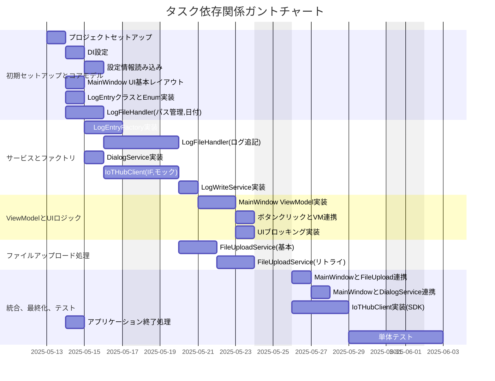

# タスク間依存関係

このドキュメントは、プロジェクト「ログ送信アプリケーション」の各実装タスク間の依存関係と、見積もり工数に基づいたスケジュールを示します。
タスクの開始日は2025年5月13日を基準とし、各タスクの期間は割り当てられたストーリーポイントに基づいて設定されています（1SP≒1日、2SP≒2日、3SP≒3日としてガントチャート上に表現）。

**凡例:**

- `Txxxx`: タスク番号 (例: `T0001` はタスク0001を指します)
- `日付, Xd`: タスクの開始日と期間 (日数)
- `after Txxxx`: 指定したタスク完了後に開始可能であることを示します

このガントチャートは、タスクの実行順序と依存関係を視覚的に把握するのに役立ちます。
週末は作業日としてカウントされていません。
