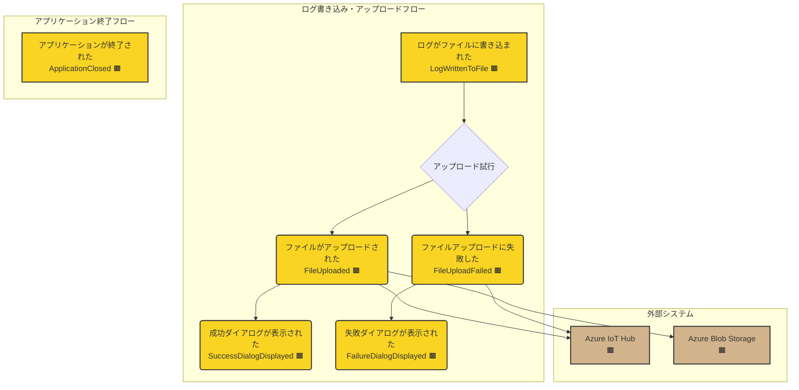

# ステップ1：ドメインイベントと外部システムの抽出

## タイムライン

## タイムラインの説明

- **ログがファイルに書き込まれた (LogWrittenToFile 🟧)**
  - ユーザーがボタンを押し、ログファイルへの書き込み（新規作成または追記）が完了した際に発生します。このイベントの後、ファイルアップロードが試行されます。
- **ファイルがアップロードされた (FileUploaded 🟧)**
  - ログファイルが **Azure IoT Hub (🟫)** から取得した SAS URI を用いて **Azure Blob Storage (🟫)** に正常にアップロードされ、その完了が IoT Hub に通知された際に発生します。
- **ファイルアップロードに失敗した (FileUploadFailed 🟧)**
  - **Azure IoT Hub (🟫)** との通信失敗（認証失敗、SAS URI取得失敗など）や、Blob Storage へのアップロード処理自体の失敗などにより、ログファイルのアップロードに失敗した際に発生します。
- **成功ダイアログが表示された (SuccessDialogDisplayed 🟧)**
  - ファイルアップロード成功後、ユーザーに成功を通知するダイアログが表示された際に発生します。
- **失敗ダイアログが表示された (FailureDialogDisplayed 🟧)**
  - ファイルアップロード失敗後、ユーザーに失敗を通知するダイアログが表示された際に発生します。
- **アプリケーションが終了された (ApplicationClosed 🟧)**
  - ユーザーが×ボタンを押してアプリケーションを終了した際に発生します。
- **Azure IoT Hub (🟫)**
  - ファイルアップロード機能（SAS URI提供など）を提供する外部システムです。デバイス認証にも関与します。
- **Azure Blob Storage (🟫)**
  - アップロードされたログファイルが最終的に格納される外部ストレージサービスです。

## 保留事項
|タイプ|内容|検討ステップ|
|-|-|-|
|コマンド🟦|ログ書き込みボタンを押す (PressLogWriteButton)|ステップ2|
|コマンド🟦|×ボタンを押す (PressCloseButton)|ステップ2|
|コマンド🟦|OKボタンを押す (PressOkButton)|ステップ2|
|ユーザーの役割⬜|一般ユーザー (GeneralUser)|ステップ2|
|読み取りモデル⬛|現在時刻 (CurrentTime)|ステップ2|
|読み取りモデル⬛|認証情報 (AuthenticationInfo)|ステップ2|
|懸念事項🟪|ログのランダムメッセージ生成ロジック|ステップ3|
|懸念事項🟪|IoT Hubへの再接続試行ロジック|ステップ3|
|懸念事項🟪|UIブロッキングの具体的な実装方法|ステップ3以降|
|懸念事項🟪|アップロードタイムアウトの扱い|ステップ3|

## ユビキタス言語辞書

| 項番 | 日本語             | 英語                 | コード変数/関数名        | 意味                                                                 | 使用コンテキスト     | 最終更新   |
| :--- | :----------------- | :------------------- | :----------------------- | :------------------------------------------------------------------- | :--------------- | :--------- |
| 1    | ログファイル       | Log File             | `logFile`                | アプリケーションが生成・更新するログデータを含むファイル             | ファイル操作     | 2025-04-21 |
| 2    | ログエントリ       | Log Entry            | `logEntry`               | タイムスタンプ、イベントタイプ、コメントを含む単一のログ記録         | ログ記録         | 2025-04-21 |
| 3    | タイムスタンプ     | Timestamp            | `timestamp`              | イベント発生時刻 (ISO 8601形式, JST)                                 | ログ記録         | 2025-04-21 |
| 4    | イベントタイプ     | Event Type           | `eventType`              | ログの種類 (START, STOP, WARN, ERROR)                                | ログ記録         | 2025-04-21 |
| 5    | コメント           | Comment              | `comment`                | ログに含まれるランダムなメッセージ                                   | ログ記録         | 2025-04-21 |
| 6    | ファイルアップロード | File Upload          | `FileUploadService.uploadAsync` | ログファイルをAzure Blob Storageにアップロードする非同期操作         | Azure連携        | 2025-04-21 |
| 7    | ログ書き込み       | Log Writing          | `LogManager.writeLogAsync` | ログファイルへのログエントリ書き込み（作成または追記）を行う非同期操作 | ファイル操作     | 2025-04-21 |
| 8    | 成功ダイアログ     | Success Dialog       | `DialogService.showSuccess` | アップロード成功時に表示されるダイアログ                             | UI表示           | 2025-04-21 |
| 9    | 失敗ダイアログ     | Failure Dialog       | `DialogService.showFailure` | アップロード失敗時に表示されるダイアログ                             | UI表示           | 2025-04-21 |
| 10   | アプリケーション終了 | Application Closing  | `Application.shutdown`   | アプリケーションを終了する操作                                       | アプリケーション | 2025-04-21 |
| 11   | Azure IoT Hub    | Azure IoT Hub        | `iotHubClient`           | ファイルアップロード機能を提供するAzureサービス                      | Azure連携        | 2025-04-21 |
| 12   | Azure Blob Storage | Azure Blob Storage   | `blobStorageClient`      | アップロードされたログファイルの格納先となるAzureサービス            | Azure連携        | 2025-04-21 |
| 13   | 認証情報         | Authentication Info  | `appSettings.authInfo`   | Azure IoT Hubへの接続に必要な情報 (接続文字列など)                 | 設定             | 2025-04-21 |
| 14   | 日本標準時       | Japan Standard Time  | `jstZoneInfo`            | ログファイルの命名やタイムスタンプに使用されるタイムゾーン (UTC+9) | 時刻処理         | 2025-04-21 |
| 15   | ログファイル書き込み完了 | Log Written To File | `LogWrittenToFile`     | ログファイルへの書き込みが完了したイベント                         | ドメインイベント | 2025-04-21 |
| 16   | ファイルアップロード完了 | File Uploaded      | `FileUploaded`         | ファイルのアップロードが成功したイベント                           | ドメインイベント | 2025-04-21 |
| 17   | ファイルアップロード失敗 | File Upload Failed   | `FileUploadFailed`     | ファイルのアップロードが失敗したイベント                           | ドメインイベント | 2025-04-21 |
| 18   | 成功ダイアログ表示完了 | Success Dialog Displayed | `SuccessDialogDisplayed` | 成功ダイアログが表示されたイベント                               | ドメインイベント | 2025-04-21 |
| 19   | 失敗ダイアログ表示完了 | Failure Dialog Displayed | `FailureDialogDisplayed` | 失敗ダイアログが表示されたイベント                               | ドメインイベント | 2025-04-21 |
| 20   | アプリケーション終了完了 | Application Closed   | `ApplicationClosed`    | アプリケーションが終了したイベント                                 | ドメインイベント | 2025-04-21 |

## チェックリスト

完了基準(21項目)の確認結果

### ドメインイベントの質と量

- [x] すべてのドメインイベントが過去形の動詞で表現されている
- [x] ドメインイベントがオレンジ色の付箋に1つずつ記載されている
- [x] 十分な量のドメインイベントが出されている（質より量を重視）
- [x] 重複や類似するイベントが許容されている（この段階での整理は不要）
- [x] すべての主要なビジネスプロセスがイベントとして表現されている
- [x] ドメインイベントがビジネス上の「重要な出来事」を表している

### 外部システムの識別

- [x] システムに関連する外部システムやサービスが識別されている
- [x] 外部システム起因のイベントが茶色で記録されている (該当なし)
- [x] 外部システムとの連携点・インターフェースが明示されている

### ユビキタス言語品質基準

- [x] 技術用語とビジネス用語の整合性
- [x] コード変数名の命名規則準拠
- [x] コンテキスト依存性の明示
- [x] 過去形動詞との矛盾なし

### シナリオ整合性

- [x] 各フロー間のイベント競合なし
- [x] 共有リソースの状態の整合性

### 見直し

- [x] ビジネスドメイン上で発生するすべての重要なイベントを挙げられたか？
- [x] 見落としている重要なビジネスプロセスはないか？
- [x] 現在のイベント群は、ドメインの全体像を十分に表しているか？

- [x] イベントの表現は全て過去形になっているか？
- [x] イベントの粒度は適切か？（細かすぎたり、大きすぎたりしていないか？）
- [x] 類似するイベントが多数ある領域は、さらに詳細化が必要ではないか？

- [x] すべての外部システムとの連携点を特定できたか？
- [x] 外部システム起因のイベントは明確に区別されているか？ (該当なし)
- [x] 外部システムとの連携において、見落としている重要なイベントはないか？

- [x] 疑問点や懸念事項は全てピンク付箋に記録されているか？ (保留事項としてリストアップ)
- [x] 次のステップ（イベントの蒸留）に進む準備ができているか？
- [x] 現状の時系列の流れに矛盾や不自然な点はないか？

- [x] 変更履歴を記載したか？

## 補足

Mermaid図の `B{アップロード試行}` は、イベントではなく処理の分岐点を示すために仮に配置しています。Step 2 でコマンドとして明確化される予定です。

## 変更履歴

|更新日時|変更点|
|-|-|
|2025-04-21T19:43:00+09:00|FileUploadedイベントの説明を修正。|
|2025-04-21T19:37:00+09:00|ユーザーフィードバックに基づきタイムライン、イベント名、外部システム関連、ユビキタス言語辞書を修正。|
|2025-04-21T19:27:00+09:00|新規作成|
